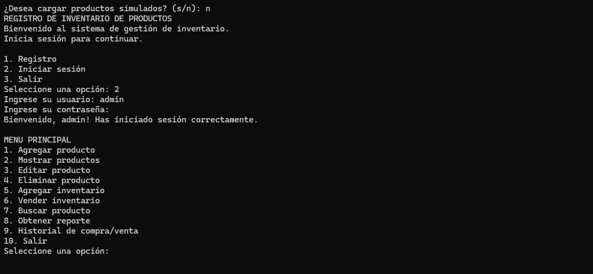
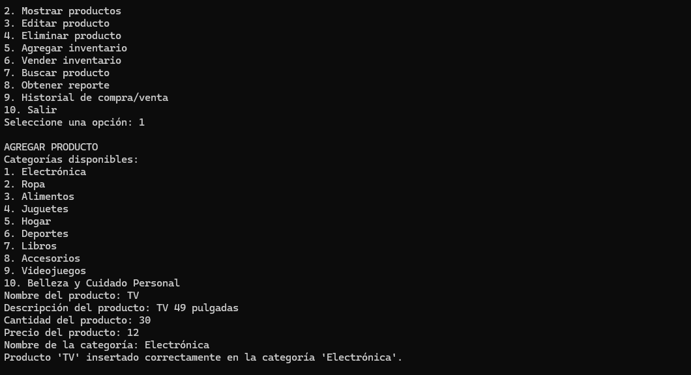
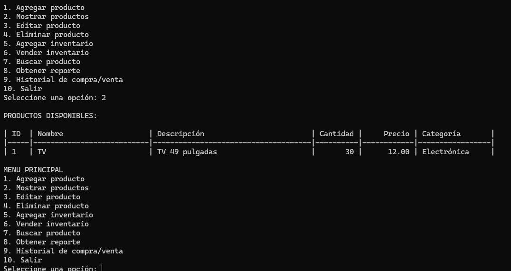
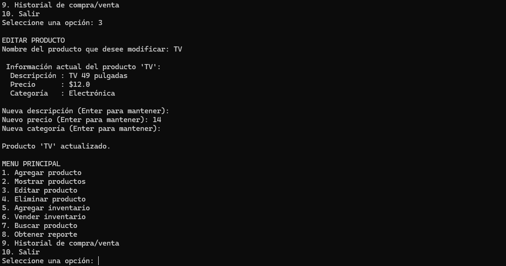
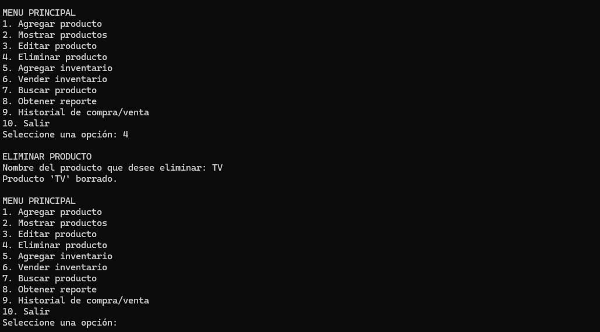
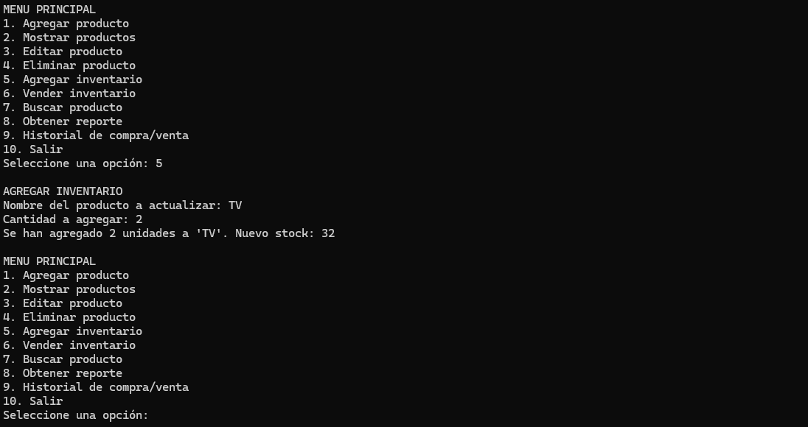
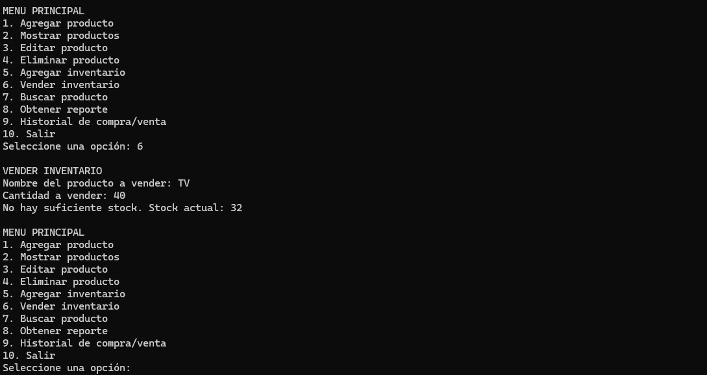
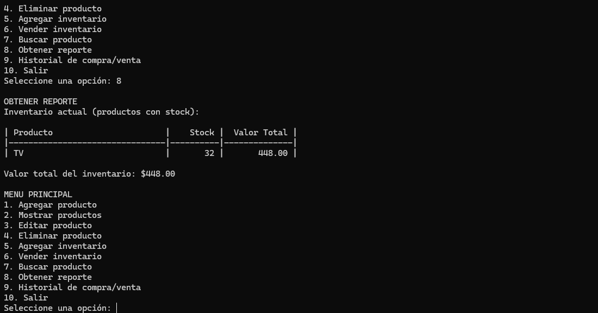
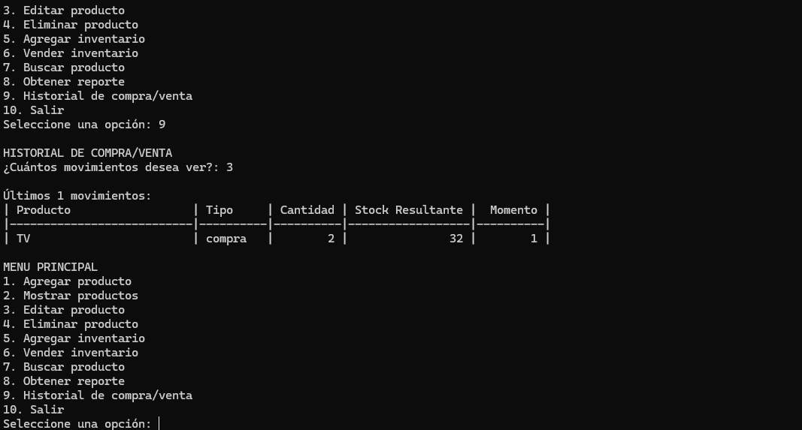

# PS-T1
Pruebas de Software - Tarea 1

- Daniel Villarroel
- Gonzalo Severín

**3.1) Aspectos formales**

1. ¿Cómo especificarías mejor el requerimiento? (Validación)

- **Realizar reuniones con el cliente**: Para aclarar algunas necesidades de los requerimientos entregados, por ejemplo, no queda claro cómo podríamos exportar el reporte, como usar Excel o un PDF.
- **Realizar historias de usuario con criterios de aceptación claros**: Crear una historia de usuario y en esta incluir diferentes criterios de aceptación para saber cuál es el flujo esperado en cada historia.

  
2. ¿Cómo asegurarías que el programa cumpla el requerimiento? (Verificación)

- Utilizar pruebas unitarias en cada función con un test correspondiente; con eso se valida e invalida los resultados y comprueba que el sistema funcione correctamente.
- Realizar pruebas de integración, para verificar el correcto funcionamiento de los módulos; por ejemplo, comprobar que el stock se actualiza cada vez que se realiza una compra/venta.
- Realizar revisiones: Ejemplo en Scrum, con un sprint review, podemos mostrarle al cliente las funcionalidades implementadas y obtener un feedback con detalles a corregir.

3. Organización, explicar cómo se organizó el proyecto y el flujo de trabajo de éste.

La estructura del proyecto se realiza en una estructura basada en Cliente-Servidor.
- db_functions.py: Conexión con base de datos y queries con la lógica de negocio.
- main.py: Archivo principal con interfaz en consola con la aplicación de gestión de inventario.

4. Incluir evidencia de flujo de trabajo y configuraciones realizadas (Imágenes de pantalla).

### Evidencia del flujo de trabajo

#### 1. Inicio del programa

#### 2. Inicio de sesión

#### 3. Menu

#### 4. Agregar producto

#### 5. Mostrar productos

#### 6. Modificar productos

#### 7. Eliminar producto generado

#### 8. Comprar productos

#### 9. Vender productos

#### 10. Reportes

#### 11. Movimientos

6. Problemas encontrados y como se solucionaron.
- **Falta de claridad con la categoría**: Al crear un producto se puede colocar cualquier categoría.
  - **Sol:** El usuario debe crear la categoría antes de crear un producto; si crea un producto con una categoría que no existe, no se acepta.

- **Productos duplicados**: Puedo crear 2 productos con el mismo nombre, pero puede existir problemas al actualizarlo.
  - **Sol"** El nombre debe ser único; no se puede aceptar 2 productos con el mismo nombre. Esto soluciona problemas al realizar compra/venta.

- **Registro de stocks**: No vender más productos de los que existen actualmente.
  - **Sol"** Realizar una verificación previa de que el stock esté disponible; además, se guardará un registro de los últimos registros de compra/venta.

**3.3) Pruebas**

- **Definir estrategias de pruebas**
  - *¿Cómo vamos a probar?* Se realizarán diferentes inputs estratégicos para probar la robustez del programa.
  - *¿Quién prueba qué?* Debido a la falta de personal, ambos probaremos diferentes inputs los cuales delimitaremos en un previo acuerdo, con el fin de que ninguno pruebe algo que el otro ya probó
  - *¿Haremos pruebas cruzadas?* Las pruebas se harán de manera individual, sin embargo, reportaremos los resultados de manera telemática una vez realizadas.

**Definición de pruebas**
  -  La estructura de las pruebas serán tal cual se expuso en el enunciado con un *id_test, entrada, resultado esperado, resultado obtenido, fallo o éxito* y *comentarios adicionales*.
